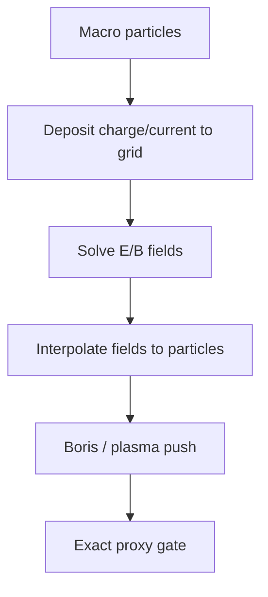

# Team Plasma GS: The Sun Also Places Macros

> The Sun gave us light, weather, photosynthesis, seasons, suspiciously cinematic sunsets, and the long-term dream of fusion energy. We asked for one more thing: macro placement.
>
> The result is not the world's strongest placer. The Sun is busy. But it is a real plasma-physics macro placer, and that is the point.

**Team Plasma GS** is a pure plasma / fusion-physics macro placement solver for the Partcl / HRT Macro Placement Challenge 2026. It treats chip placement as a Grad-Shafranov / MHD equilibrium problem: macros are current-bearing particles, nets induce current topology, congestion behaves like pressure, and placement is a relaxation toward a low-energy plasma state.

The active competition package is locked to:

```text
submissions/team_plasma/
```

**Team Plasma GS** is the algorithm/model name. **`submissions/team_plasma/`** is the folder that should be copied into, run from, and submitted for the challenge.

The augmented TILOS-assisted versions still exist for research, but they are not the main submission.

---

## Reviewer Quick Path

If you only have two minutes, read these sections:

1. [What This Submission Is](#what-this-submission-is)
2. [Pure vs Augmented](#pure-vs-augmented)
3. [How Plasma Becomes Placement](#how-plasma-becomes-placement)
4. [Results](#results)
5. [Submission Readiness](#submission-readiness)

---

## What This Submission Is

| Question | Answer |
|---|---|
| Main submission | Pure plasma Team Plasma GS |
| Entry point | `submissions/team_plasma/placer.py` |
| Active config | `submissions/team_plasma/config.json` |
| License | Apache 2.0 |
| Benchmark hardcoding in active config | None |
| Active TILOS soft optimization | No |
| Active TILOS PLC warm start | No, disabled by purity mode |
| Internal time budget | `1300s` |
| Intended award story | Innovation / methodology |

The short version:

```text
We solve macro placement as plasma equilibrium.
The proxy score is worse than augmented TILOS-assisted placement.
The physics story is much stronger.
```

---

## Run It

This repository is a clean public release of the submission package. To run it inside the official challenge repository, copy or keep `submissions/team_plasma` under that repository's `submissions/` directory and evaluate the placer:

```powershell
uv run evaluate submissions/team_plasma/placer.py -b ibm02
```

For the pure submission:

```text
Do not set TEAM_PLASMA_GS_CONFIG.
```

The default adjacent `config.json` is the clean pure-plasma config. Do not point `TEAM_PLASMA_GS_CONFIG` at an experimental config for the pure competition run.

---

## Submission Readiness

The active source package was audited before submission.

| Check | Status |
|---|---|
| Active pure config | Passed |
| Public release contains only required solver package | Passed |
| JSON config parses | Passed |
| Python modules compile | Passed |
| Apache 2.0 `LICENSE` present | Passed |
| No `ibmXX` hardcoding in active config | Passed |
| No nonempty `*_by_benchmark` / `*_auto_benchmarks` routing in active config | Passed |
| TILOS soft optimizer disabled | Passed |
| Purity assertion crash risk disabled | Passed |
| Internal budget reduced for runtime safety | Passed, `1300s` |

The active config intentionally chooses purity and compliance over the absolute best proxy score.

---

## One-Screen Architecture

```mermaid
flowchart LR
    A[Netlist + Canvas] --> B[R1 Plasma Startup]
    B --> C[Grad-Shafranov Field Solve]
    C --> D[R4 Two-Fluid Transport]
    D --> E[R2 Sheath Legalization]
    E --> F[Instability Refinement]
    F --> G[Exact Proxy Gate]
    G --> H[Legal Placement]

    B:::plasma
    C:::plasma
    D:::plasma
    E:::plasma
    F:::plasma
    G:::gate

    classDef plasma fill:#e9f6ff,stroke:#0b5d7a,color:#111,stroke-width:2px;
    classDef gate fill:#fff3cd,stroke:#9a6a00,color:#111,stroke-width:2px;
```



Plain-text fallback:

```text
Netlist + canvas
  -> R1 plasma startup
  -> Grad-Shafranov equilibrium solve
  -> R4 two-fluid soft-macro transport
  -> R2 Bohm-sheath / continuation legalization
  -> plasma instability refinements
  -> exact proxy gate
  -> legal placement
```

---

## How Plasma Becomes Placement

The core analogy is variational: both placement and plasma equilibrium seek a low-energy state under constraints.

```text
Placement objective:

    W_place(x) = WL(x) + 0.5 * Density(x) + 0.5 * Congestion(x)

MHD equilibrium energy:

    W_MHD = integral( B^2 / 2mu0 + p/(gamma - 1) + 0.5 rho v^2 ) dV

Shared algorithmic idea:

    relax toward a low-energy state while preserving topology and legality
```

### Translation Table

| Fusion / Plasma Term | Placement Interpretation | Why It Matters |
|---|---|---|
| Poloidal flux `psi` | Placement potential over the chip | Gives a global field that macros respond to |
| Grad-Shafranov equation | Self-consistent equilibrium PDE | Couples pressure, current, and geometry |
| Plasma pressure `p(psi)` | Density / congestion demand | Hot dense regions push back |
| Toroidal current `F(psi)` | Netlist connectivity current | Connected macros shape the field |
| Internal coils | Hard macros | Current-bearing objects in the plasma |
| Electrons | Soft macros | Fast species; equilibrate quickly |
| Ions | Hard macros | Heavy species; move slowly |
| Debye shielding | Finite-radius repulsion | Prevents local collapse |
| Plasma sheath | Canvas boundary pressure | Keeps macros inside the chamber |
| Mercier stability | Congestion-tail stabilization | Suppresses unstable hot spots |
| Taylor relaxation | Global energy relaxation | Moves toward a lower-energy topology |
| Tearing modes | Coordinated cluster moves | Escapes local basins |
| PIC / P3M | Particle-grid-particle solver | Plasma-native proposal generator |
| Biot-Savart attraction | Pairwise current attraction | Plasma analog of connected-pair attraction |

---

## The Pipeline, Stage by Stage

### R1: Plasma Startup

R1 builds the initial plasma state. Instead of using a classical TILOS PLC warm start, it places macros using graph/current structure and flux-band ideas.

```text
netlist graph -> current topology -> flux bands -> initial macro plasma
```

What it does:

- Converts graph structure into current-bearing topology.
- Places hard macros on flux-like bands.
- Initializes soft macros with plasma density / phase-locking rules.
- Avoids TILOS PLC warm start in pure mode.

### Grad-Shafranov Field Solve

The solver then computes a self-consistent `psi` field. This is the central plasma equilibrium equation used in tokamak modeling.

```text
Delta-star(psi) = -mu0 * R^2 * p'(psi) - F(psi) * F'(psi) - current_sources
```

In placement language:

- `psi` is the global placement potential.
- `p'(psi)` represents density / congestion pressure.
- `F(psi)F'(psi)` represents net-induced current structure.
- hard macros act as internal current sources.

### R4: Two-Fluid Transport

R4 handles soft macros as the fast species in a two-fluid plasma.

```text
hard macros = ions      slow, massive
soft macros = electrons fast, responsive
```

The soft macros equilibrate against the current `psi` field before the next hard-macro update. This gives a plasma-native alternative to classical soft-cell optimization.

### R2: Bohm-Sheath Legalization

R2 removes overlaps using continuation and sheath-style forces.

```text
overlap pressure + wall sheath + continuation beta -> legal hard macros
```

This stage is why the pure submission can return zero-overlap placements without making strict TILOS legalization the load-bearing path.

### Instability Refinement

Real plasmas do not only relax smoothly. They also reorganize through instabilities. Team Plasma GS includes exact-gated versions of:

- Mercier interchange shaping.
- Tearing-mode cluster movement.
- NTM-suppression-inspired targeted refinement.
- Flux-rope cluster moves.
- Snowflake-divertor research moves.

The official proxy gate decides whether a proposed move is kept.

### R5: PIC / P3M Research Module

R5 exists in the codebase as a plasma Particle-In-Cell / P3M proposal module.



R5 added real plasma-PIC ideas:

- charge deposition,
- field solves,
- Debye-shielded interactions,
- magnetic forces,
- pairwise Biot-Savart current attraction.

It remains disabled in the final active pure config because it was not robust enough across the suite before deadline.

---

## Pure vs Augmented

This distinction is important.

### Pure Plasma Submission

This is what the final active config runs.

```text
submissions/team_plasma/config.json
```

Characteristics:

- plasma startup instead of TILOS PLC,
- two-fluid transport instead of TILOS soft optimization,
- plasma legalization instead of strict legalization as the load-bearing path,
- no benchmark-name routing in active config,
- worse proxy score,
- stronger Innovation claim.

### Augmented / Research Versions

The broader internal research project also has augmented configs. They are intentionally not bundled in this clean public release, because this repository is meant to be unambiguous: it ships the pure plasma competition package.

Those augmented versions are useful for research and proxy hunting. They can be much stronger because TILOS remains load-bearing in certain areas, especially classical soft-cell optimization and refinement. Plasma physics then acts as an additional layer.

That is a practical strategy, but it is not the pure plasma submission.

### Comparison

| Mode | Proxy Strength | Physics Purity | Main Use |
|---|---|---|---|
| Pure plasma | Worse | Highest | Innovation submission |
| Augmented TILOS + plasma | Better | Medium | Research / leaderboard-style experiments |
| Classical TILOS-style placement | Best baseline behavior | Low for this project | Reference point |

---

## Results

### Full Pure-Plasma Suite Summary

The table below summarizes the best full official-harness pure-plasma suite run from the final internal audit. That run predates the final `time_budget_sec=1300` safety reduction, so very long benchmarks may return slightly earlier in the public submission configuration.

| Summary Metric | Value |
|---|---:|
| Valid benchmarks | `17 / 17` |
| Hard overlaps | `0` |
| Average proxy | `3.3653` |
| Total runtime | `25570.11s` |
| Average runtime | `1504.1s` |

### Per-Benchmark Results

| Benchmark | Proxy | WL | Density | Congestion | Runtime | Valid |
|---|---:|---:|---:|---:|---:|---|
| ibm01 | 2.2431 | 0.218 | 0.823 | 3.226 | 533.38s | yes |
| ibm02 | 2.5615 | 0.228 | 0.752 | 3.915 | 727.11s | yes |
| ibm03 | 2.7403 | 0.239 | 0.860 | 4.142 | 430.31s | yes |
| ibm04 | 2.6192 | 0.214 | 0.863 | 3.947 | 583.91s | yes |
| ibm06 | 3.3843 | 0.228 | 0.785 | 5.527 | 1517.98s | yes |
| ibm07 | 3.0691 | 0.205 | 0.892 | 4.836 | 767.90s | yes |
| ibm08 | 3.3196 | 0.221 | 0.859 | 5.337 | 1421.88s | yes |
| ibm09 | 2.6965 | 0.199 | 0.882 | 4.113 | 1378.98s | yes |
| ibm10 | 2.9904 | 0.201 | 0.763 | 4.815 | 1821.44s | yes |
| ibm11 | 2.9010 | 0.207 | 0.905 | 4.482 | 1383.37s | yes |
| ibm12 | 3.9146 | 0.194 | 0.859 | 6.583 | 2159.33s | yes |
| ibm13 | 3.0825 | 0.200 | 0.961 | 4.803 | 1601.90s | yes |
| ibm14 | 4.5315 | 0.185 | 0.939 | 7.753 | 2445.39s | yes |
| ibm15 | 4.1704 | 0.219 | 1.027 | 6.876 | 1552.03s | yes |
| ibm16 | 3.8474 | 0.190 | 0.879 | 6.435 | 1756.23s | yes |
| ibm17 | 5.4864 | 0.185 | 0.886 | 9.717 | 3407.46s | yes |
| ibm18 | 3.6531 | 0.156 | 0.908 | 6.085 | 2081.52s | yes |

### Final Clean Config Smoke Check

After removing benchmark-name routing and preparing the clean pure config, we ran a targeted smoke check on representative benchmarks:

| Benchmark | Proxy | WL | Density | Congestion | Runtime | Purity |
|---|---:|---:|---:|---:|---:|---|
| ibm02 | 2.5977 | 0.2282 | 0.7680 | 3.9710 | 766.31s | yes |
| ibm03 | 2.7371 | 0.2391 | 0.8618 | 4.1342 | 365.50s | yes |
| ibm06 | 3.3849 | 0.2285 | 0.7883 | 5.5245 | 769.59s | yes |

The final active config uses `time_budget_sec=1300`. The smoke benchmarks above all ran under that limit. The expected suite-average cost of the budget reduction is roughly `+1%` to `+2.5%`, but it reduces timeout risk on the longest cases.

---

## Why the Proxy Is Worse Than Augmented

The weakness is congestion.

The competition proxy strongly rewards classical placement behavior that TILOS is already very good at. Pure plasma removes those classical load-bearing pieces and replaces them with physical analogs: pressure, flux, current, transport, sheath forces, and instabilities.

That makes the method scientifically cleaner but less directly aligned with the proxy.

```text
Augmented version:
    TILOS does the heavy classical placement work.
    Plasma modules add refinements.
    Proxy score is better.

Pure version:
    Plasma modules carry the placement pipeline.
    Proxy score is worse.
    Innovation claim is stronger.
```

---

## Repository Layout

```text
Plasma-Fusion-Physics-Macro-Place-Algo/
  README.md
  LICENSE
  submissions/
    team_plasma/
      placer.py                     top-level TeamPlasmaPlacer
      config.json                   active pure submission config
      config.py                     config schema / loader
      plasma_init.py                R1 plasma startup
      gs_solver.py                  Grad-Shafranov solver
      two_fluid.py                  R4 two-fluid transport
      legalization.py               R2 legalization
      pic_placer.py                 optional R5 PIC/P3M research module
      stability.py                  Mercier / stability shaping
      smooth_proxy.py               smooth guidance fields
      LICENSE                       Apache 2.0
```

---

## File Guide

| File | Purpose |
|---|---|
| `placer.py` | Main orchestrator. Wires all physics stages together. |
| `config.json` | Active pure-plasma submission settings. |
| `config.py` | Config schema and JSON loader. |
| `plasma_init.py` | R1 startup, flux bands, soft initialization. |
| `gs_solver.py` | Grad-Shafranov finite-difference solver. |
| `profiles.py` | Density, RUDY, pressure and current profiles. |
| `two_fluid.py` | R4 soft-macro two-fluid transport. |
| `legalization.py` | R2 hard-macro overlap removal. |
| `sheath_legalize.py` | Bohm-sheath legalization tools. |
| `pic_placer.py` | Optional R5 PIC / P3M proposal module. |
| `stability.py` | Mercier and stability-inspired shaping. |
| `smooth_proxy.py` | Smooth proxy / hotspot guidance fields. |
| `coils.py` | Macro current and coil force helpers. |
| `geometry.py` | Cylindrical embedding and interpolation. |

---

## What Is Active in the Final Pure Config?

| Mechanism | Active? | Notes |
|---|---|---|
| R1 plasma startup | yes | replaces TILOS PLC warm start |
| Grad-Shafranov solve | yes | central equilibrium field |
| R4 two-fluid transport | yes | replaces TILOS soft optimization |
| R2 continuation legalization | yes | pure legality path |
| Mercier / NTM-style refinement | yes | exact-gated |
| Flux-rope cluster moves | yes | budget-capped |
| R5 PIC / P3M | no | available as research, disabled in final config |
| Soft TILOS optimization | no | disabled in pure submission |
| Benchmark-name routing | no | active config is clean |

---

## Known Limitations

- Congestion is still the dominant error term.
- Pure plasma is much worse than the augmented TILOS-assisted version on proxy score.
- R5 PIC/P3M works on some cases but is not robust enough for global activation.
- Long benchmarks require conservative budget caps.
- Future work should move dimensionless plasma regime selection earlier into R1/R4, not only late proposal stages.

---

## For Reviewers

This is not a claim that plasma physics beats mature classical placement today. It does not.

This is a claim that macro placement can be formulated, implemented, and submitted as a plasma equilibrium problem:

```text
R1 plasma startup
+ Grad-Shafranov equilibrium
+ R4 two-fluid transport
+ R2 sheath legalization
+ plasma instability refinements
= legal pure-plasma macro placement
```

The Sun has not dethroned classical placers. But it did produce 17 legal IBM placements, which is a wonderfully unreasonable thing for a star to help with.
